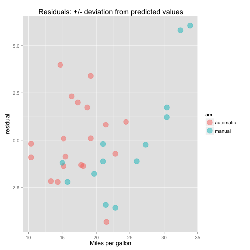

# Automobile Characteristics vs. Fuel Efficiency 

## Executive Summary

In this analysis, relationship between various automobile characteristics and fuel efficiency was explored. In particular, different transmission types (automatic and manual) and their influence on miles per gallon efficiency as an outcome was investigated. A multivariate regression analysis revealed that although there appears to be a significant correlation between fuel efficiency and vehicle transmission type, weight is actually the significant factor.


## Data

The data set is described at [Motor Trend Car Road Tests](https://stat.ethz.ch/R-manual/R-devel/library/datasets/html/mtcars.html) and consists of 
data was extracted from the 1974 Motor Trend US magazine. 


```r
  data(mtcars)
  mtcars.cols <- colnames(mtcars)
  mtcars.dim <- dim(mtcars)
```

## Variables and Observations

There are **11** variables (vehicle characteristics) on **32** observations (automobiles).

* mpg - Miles/(US) gallon
* cyl - Number of cylinders
* disp - Displacement (cu.in.)
* hp - Gross horsepower
* drat - Rear axle ratio
* wt - Weight (lb/1000)
* qsec - 1/4 mile time
* vs - V/S
* am - Transmission (0 = automatic, 1 = manual)
* gear - Number of forward gears
* carb - Number of carburetors

## Processing
Minimal preprocessing/transformation is performed on the data to
prepare for analysis.

```r
  # convert 'am' character boolean to factor variable with meaningful label
  mtcars$am <- factor(mtcars$am, labels=c("automatic", "manual"))
```

## Exploratory Data Analysis

### Fuel Efficiency and Vehicle Characteristics

A pairs plot is generated to view the relationship between fuel efficiency
and a few characteristics of interest. In particular, we're expecting
a few key variables might have an influence on fuel efficiency.


```r
  pairs(data=mtcars, mpg ~ wt + cyl + disp + am,
    panel=panel.smooth, main="Vehicle Characteristic Relationships",
    col=mtcars$am)
```

 

Transmission type is highlighted by color (automatic = black, manual = red).

On the surface, looking at the plot for "mpg" vs. "am", transmission type
has a significant correlation with fuel efficiency.


```r
  mEfficiency <- mean(mtcars[mtcars$am == "manual", ]$mpg)
  aEfficiency <- mean(mtcars[mtcars$am == "automatic", ]$mpg) 
  mWeight <- mean(mtcars[mtcars$am == "manual", ]$wt*1000) 
  aWeight <- mean(mtcars[mtcars$am == "automatic", ]$wt*1000)
```

The data indicates the same as, on average, manual transmission vehicles are
**7mpg** more efficient than automatic
transmission vehicles.


## Linear Regression

Let's visualize the linear regression model for weight vs efficiency
with a plot.

```r
  ggplot(mtcars) + aes(x=wt, y=mpg) +
    xlab("Weight (lb/1000)") + 
    ylab("Miles per (US) gallon") +
    geom_point(shape=19, size=5, alpha=1/2, aes(color=am)) +
    geom_smooth(method = "lm") +
    ggtitle("Linear Regression - Vehicle Weight vs. Fuel Efficiency")
```

 

Weight appears to be a confounding factor which heavily influences the fact
that manual transmission vehicles are
**7mpg** more efficient than automatic
transmission vehicles. Automatic transmission vehicles weigh,
on average, **1357lbs** more than manual
transmission vehicles.

## Multivariate Regression Analysis

A simplistic linear model with a single predictor is not sufficient. A
multivariable regression with multiple predictors can be applied to 
determine the independent influence of each of the variables.


```r
  lmodel <- lm(mpg ~ wt + cyl + disp + am, data=mtcars)
```

And the coefficients per variable

```r
  smc <- summary(lmodel)$coefficients
  smc
```

```
##                 Estimate Std. Error    t value     Pr(>|t|)
## (Intercept) 40.898313414 3.60154037 11.3557837 8.677574e-12
## wt          -3.583425472 1.18650433 -3.0201537 5.468412e-03
## cyl         -1.784173258 0.61819218 -2.8861142 7.581533e-03
## disp         0.007403833 0.01208067  0.6128661 5.450930e-01
## ammanual     0.129065571 1.32151163  0.0976651 9.229196e-01
```

### Coefficient Intepretation

* For every 1000lb increase in vehicle weight, we expect an estimated
**3.58mpg** decrease in fuel efficiency.
* For every increase in 1 cylinder, we expect a
**1.78mpg** decrease
in fuel efficiency.
* For every cubic inch increase in displacement, we expect a
**0.01mpg** increase in fuel efficiency
* For manual transmission vehicles, we expect a
**0.13mpg** advantage
over automatic transmission vehicle.

### Residuals

Residual values are added to the dataset from the model
and a plot generated to visualize the differences between observed
and predicted values. 


```r
  mtcars$residual <- summary(lmodel)$residuals # add the residuals to the frame

  ggplot(mtcars) + aes(x=mpg, y=residual, color=am) +
    xlab("Miles per gallon") + 
    ylab("residual") +
    geom_point(shape=19, size=5, alpha=1/2, aes(color=am)) +
    ggtitle("Residuals: +/- deviation from predicted values")
```

 

The values are fairly random, indicating that the multivariate model is not
a bad predictor of fuel efficiency.

Note that when the points are color coded by transmission type, though, 
a slight bias above/below the mean becomes evident for each respective group,
indicating that an even more sophisticated model might be an even better
predictor.

### Uncertainty

A confidence interval can be computed around the predicted relationship
between fuel efficiency and vehicle weight


```r
  sumCoef <- summary(lmodel)$coefficients
  interval <- sumCoef[2, 1] + c(-1, 1) * qt(.975, df=lmodel$df) * sumCoef[2, 2]
```
With 95% certainty, we can say that a 1000lb increase in vehicle size
will result in a
**1.1mpg** to
**6.0mpg** **decrease**
in fuel efficiency.

## Conclusion

Manual transmission vehicles in the sample data are more fuel efficient than
automatic transmission vehicles. In the data analyzed, they are
on average **7mpg** more efficient.

However, automatic transmission vehicles in this data set weigh on average
**1357lbs** more than manual transmission vehicles.

A multivariate regression analysis indicates that weight is the
most significant factor in determining vehicle fuel efficiency.

For every 1000lb increase in vehicle weight, we expect an estimated
**3.58mpg** decrease in vehicle fuel efficiency.

Factoring out the influence of weight, there isn't a statistically
significant benefit of manual vs. automatic transmissions.
In the sample data, the estimated benefit is just
**0.01mpg**


